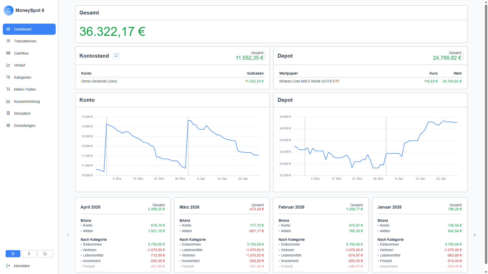
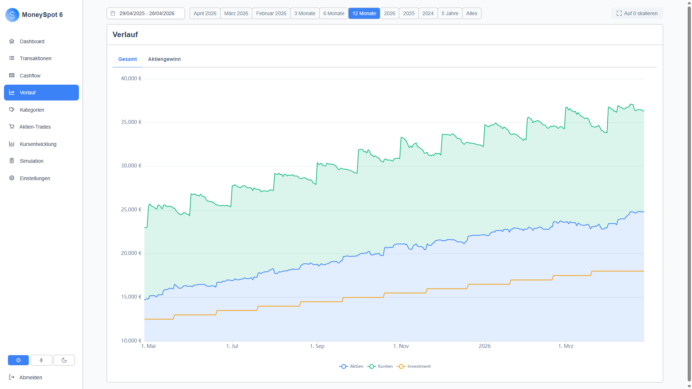
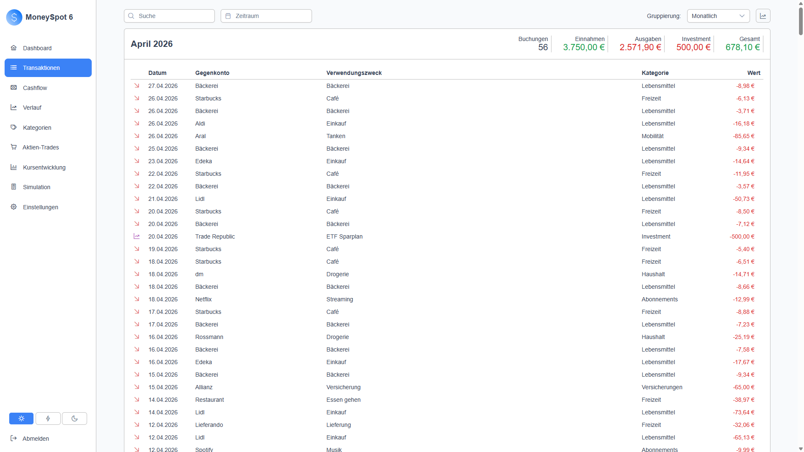
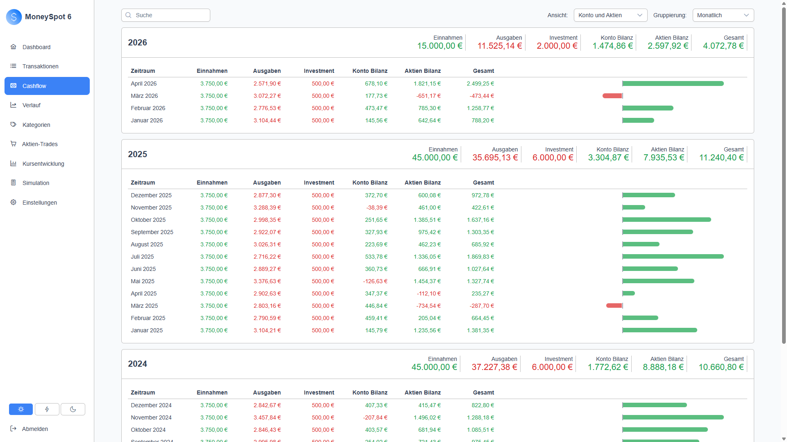
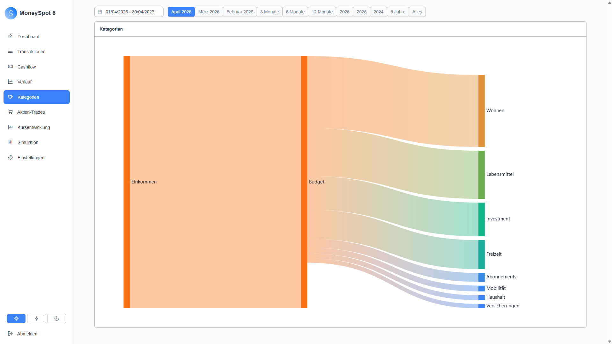
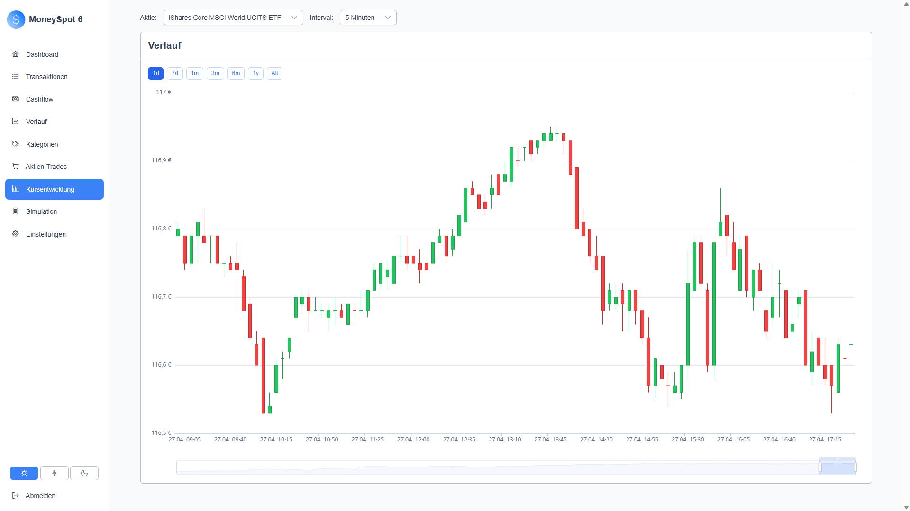

# MoneySpot6

A self-hosted personal finance management application with German bank integration (FinTS/HBCI), stock tracking, smart categorization, and financial simulations.

## Contents

- [Features](#features)
- [Screenshots](#screenshots)
- [How to Run](#how-to-run)
  - [SQLite](#sqlite)
  - [PostgreSQL](#postgresql)
  - [Authentication](#authentication)
  - [Self-Update](#self-update)
  - [Image Tags](#image-tags)
- [Development](#development)
  - [Tech Stack](#tech-stack)
  - [Prerequisites](#prerequisites)
  - [Local Development (Aspire)](#local-development-aspire)
- [Project Structure](#project-structure)
- [License](#license)

## Features

- **Bank Sync** - Connect to German bank accounts via FinTS/HBCI protocol with TAN support
- **Transaction Management** - View, search, override and categorize transactions
- **Hierarchical Categories** - Organize transactions in a tree structure
- **Rules Engine** - Auto-categorize transactions with custom TypeScript rules
- **Stock Tracking** - Monitor portfolio performance with historical price charts
- **Cash Flow Analysis** - Visualize income and spending patterns over time
- **Financial Simulations** - Run forecasting scenarios with a scripting environment
- **Inflation Data** - Track purchasing power with VPI/CPI data (German Federal Statistics Office)
- **Email Monitoring** - Detect transactions from email notifications (Gmail)

## Screenshots

|                                              |                                                |                                                        |
| -------------------------------------------- | ---------------------------------------------- | ------------------------------------------------------ |
| **Dashboard**                                | **Verlauf**                                    | **Transaktionen**                                      |
|  |        |     |
| **Cashflow**                                 | **Kategorien (Sankey)**                        | **Kursentwicklung**                                    |
|    |  |  |

## How to Run

MoneySpot6 ships as a single Docker image. Pick a database backend below, then layer on authentication and self-update as needed. After starting the container, open `http://localhost` in your browser.

### SQLite

The simplest setup. No external database required. The Docker volume keeps your data across container restarts and image updates.

```bash
docker run -d --restart unless-stopped -p 80:80 -v moneyspot6-data:/app/data dvetter/moneyspot6
```

The SQLite database file lives at `/app/data/moneyspot.db` inside the container. The example maps that path to a Docker named volume called `moneyspot6-data`. To inspect the data outside the container, replace the volume with a host bind mount (e.g. `-v /srv/moneyspot:/app/data`).

### PostgreSQL

Use PostgreSQL if you already run a database server, want backups handled at the database level, or plan to scale beyond a single instance later. The connection string is passed through the `ConnectionStrings__db` environment variable.

```bash
docker run -d --restart unless-stopped -p 80:80 \
  -e ConnectionStrings__db="Host=myserver;Database=moneyspot;Username=postgres;Password=secret" \
  dvetter/moneyspot6
```

The schema is created and migrated automatically on first start; just point the connection string at an empty database the user can write to.

### Authentication

By default the app runs without authentication. Every request is treated as a single admin user — the model intended for self-hosting in a trusted network (LAN, VPN).

> **Security note:** Do not expose a no-auth deployment to the public internet without a reverse proxy that adds authentication. Anyone reaching the app gets full access.

To enable OpenID Connect (Authentik, Keycloak, Auth0, etc.):

| Variable             | Description                                                 |
| -------------------- | ----------------------------------------------------------- |
| `Auth__Type`         | `oidc` to enable, `none` (or unset) for no auth             |
| `Auth__Authority`    | OIDC issuer URL                                             |
| `Auth__ClientId`     | OIDC client ID                                              |
| `Auth__ClientSecret` | OIDC client secret                                          |
| `Domain`             | Public URL of this app, used to build the OIDC redirect URI |

```bash
docker run -d --restart unless-stopped -p 80:80 \
  -e Auth__Type=oidc \
  -e Auth__Authority=https://auth.example.com/application/o/moneyspot/ \
  -e Auth__ClientId=YOUR_CLIENT_ID \
  -e Auth__ClientSecret=YOUR_CLIENT_SECRET \
  -e Domain=https://moneyspot.example.com \
  -v moneyspot6-data:/app/data dvetter/moneyspot6
```

### Self-Update

MoneySpot6 can update itself from the UI (Settings > System). To enable this, mount the Docker socket:

```bash
docker run -d --restart unless-stopped -p 80:80 -v /var/run/docker.sock:/var/run/docker.sock -v moneyspot6-data:/app/data dvetter/moneyspot6
```

The app checks for new images periodically and lets you apply updates with one click. Update logs are persisted and viewable in the UI.

> **Security note:** Mounting the Docker socket gives the container full control over the Docker daemon on the host. Only do this if you trust the application and run it in a private network. Without the socket mounted, the app works fine but the update feature will be disabled.

### Image Tags

- `dev` — latest build from the develop branch
- `latest` — latest stable release from master

## Development

### Tech Stack

| Component    | Technology                                   |
| ------------ | -------------------------------------------- |
| Backend      | .NET 10, ASP.NET Core, Entity Framework Core |
| Frontend     | Angular 20, PrimeNG, Apache ECharts          |
| Bank Adapter | Kotlin/Java 21, HBCI4J                       |
| Database     | SQLite or PostgreSQL                         |
| Auth         | OpenID Connect                               |
| Local Dev    | .NET Aspire                                  |

### Prerequisites

- [.NET 10 SDK](https://dotnet.microsoft.com/)
- [Node.js 22](https://nodejs.org/)
- [JDK 21](https://aws.amazon.com/corretto/)
- [Docker](https://www.docker.com/)

### Local Development (Aspire)

```bash
cd src/backend
dotnet run --project MoneySpot6.AppHost
```

This starts all components including PostgreSQL, the HBCI adapter, backend and frontend. Docker must be running.

## Project Structure

```
src/
  backend/
    MoneySpot6.WebApp/          # ASP.NET Core backend + API
    MoneySpot6.WebApp.Tests/    # Unit + Playwright UI tests
    MoneySpot6.AppHost/         # Aspire orchestration
  frontend/                     # Angular SPA
  hbci-adapter/                 # Kotlin HBCI/FinTS bridge
  deployment/                   # Linux systemd install script
```

## License

MIT — see [LICENSE](LICENSE).
